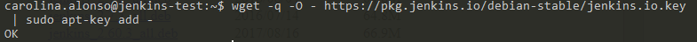
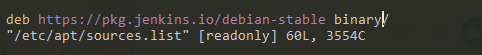
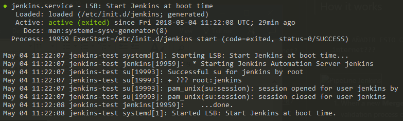
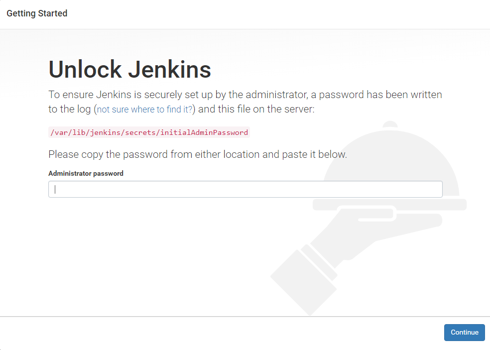
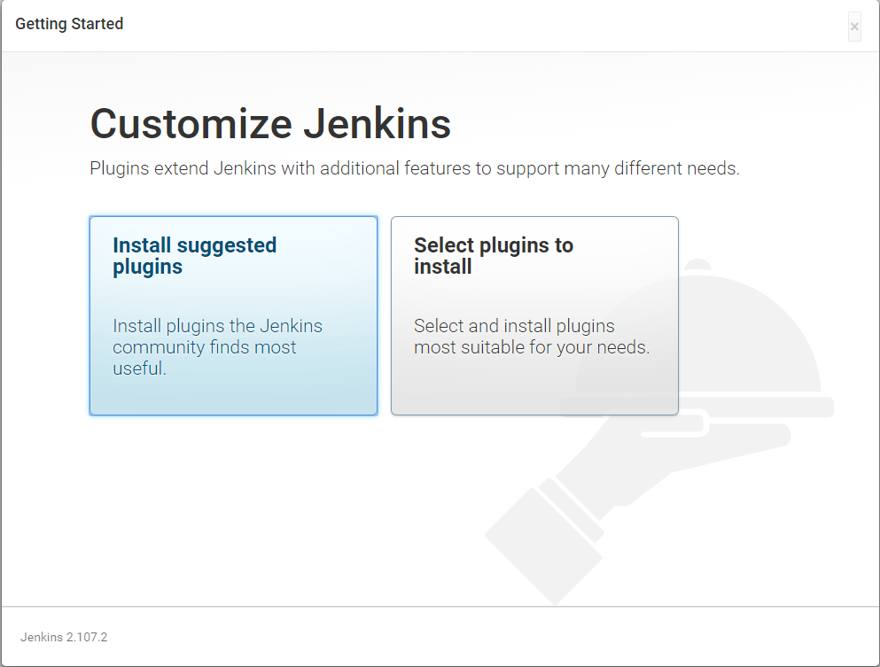
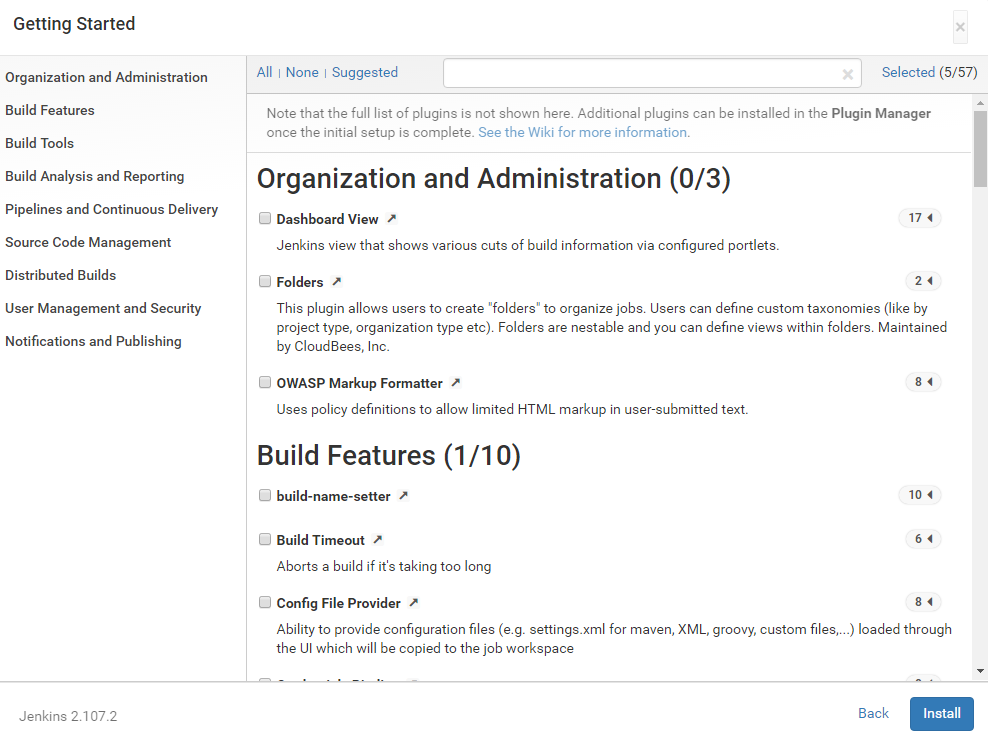
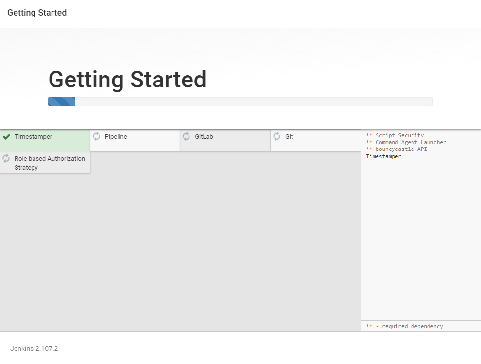
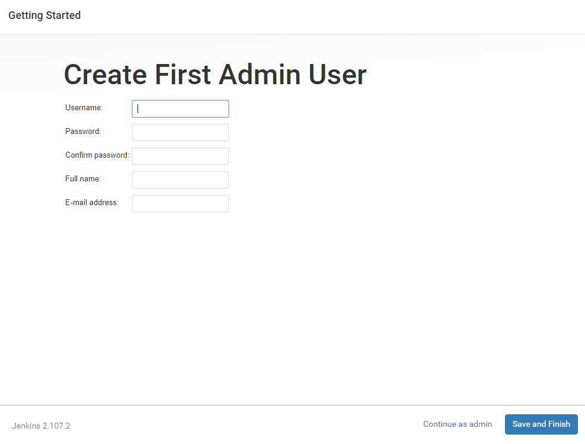
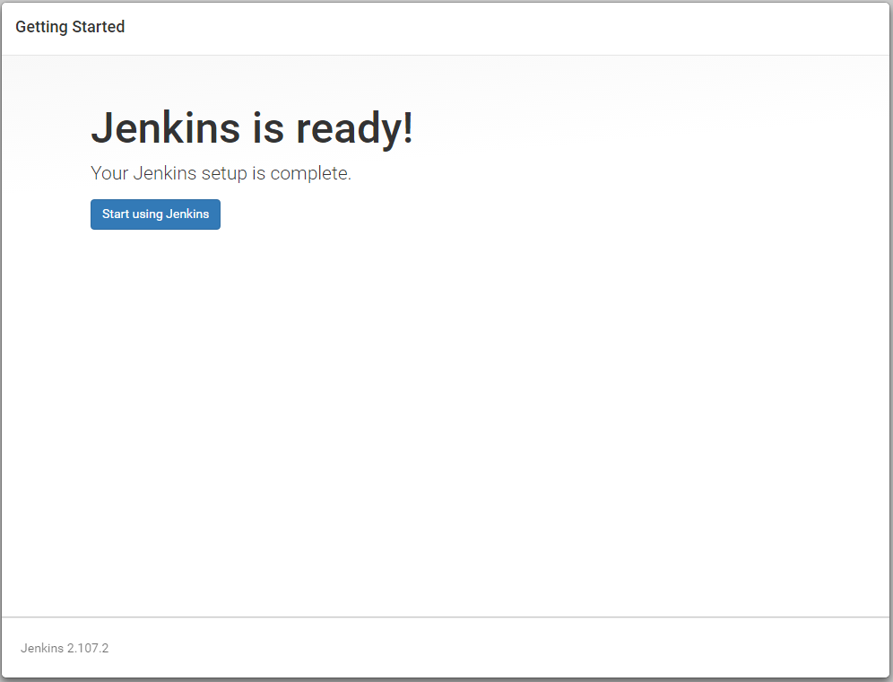
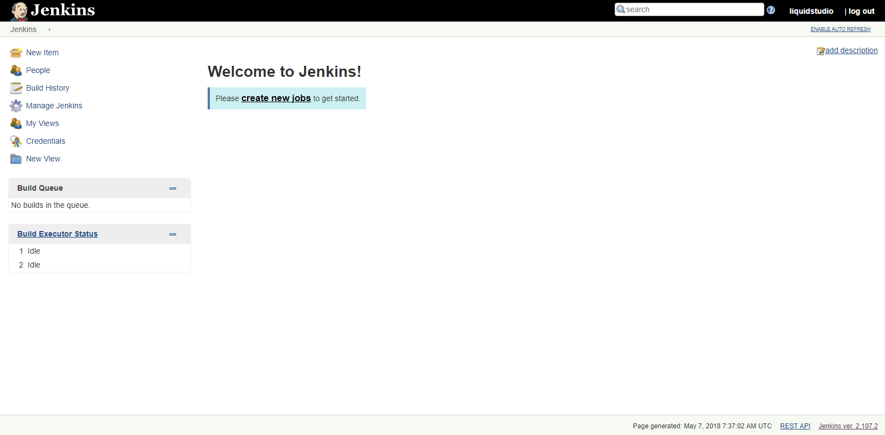

# INSTALACIÓN DE JENKINS

- [1. PRERREQUISITOS](#1-prerrequisitos)
- [2. INSTALACIÓN](#2-instalacion)
- [3. START JENKINS](#3-start-jenkins)
- [4. ACCESS JENKINS](#4-access-jenkins)


## 1. PRERREQUISITOS

✔️ Tener acceso a la terminal.

✔️ **OJO:** Ubuntu 18.04 tiene por defecto openjdk 9 que no es soportado por Jenkins.

✔️ **Por tanto**, antes de instalar Jenkins debes instalar openjdk 8 (hacer un “sudo apt-get update” si no se encuentra el paquete):

     $sudo apt-get install openjdk-8-jdk

✔️ Si ya instalaste Jenkins y utilizó JDK 9. Hay que instalar JDK 8 y después:

    $sudo update-alternatives –config java

## 2. INSTALACIÓN

**Esta instalación está basada en un Ubuntu 18.04**

1. Se recomienda partir de un sistema UNIX, nosotros utilizamos Ubuntu.
2. Acceder a la página de Jenkins https://jenkins.io/download/ y descargar la versión adecuada para tu equipo, nosotros instalaremos la versión para Ubuntu.
3. Antes de poder usar el repositorio, hay que añadir la siguiente clave a tu sistema:

    $ wget -q -O - https://pkg.jenkins.io/debian-stable/jenkins.io.key | sudo apt-key add

    
4. Después, hay que añadir la siguiente entrada en tu /etc/apt/sources.list:

    $deb https://pkg.jenkins.io/debian-stable binary/

    

    4.1. Accedo a /etc/apt/sources.list:

        $sudo vim /etc/apt/sources.list

    4.2. Inserto la entrada al final del fichero.

        $deb https://pkg.jenkins.io/debian-stable binary/

    4.3. Guardo y salgo de la configuración **esc** y **:wq**

5. Actualizar el índice de paquete local:

    $ sudo apt-get update
6. Instalar Jenkins:

    $ sudo apt-get install jenkins

## 3. START JENKINS

Una vez instalado Jenkins,

    $sudo service jenkins start

Para ver el estado en que se encuentra Jenkins, haremos: 

    $sudo service jenkins status

Y nos muestra la siguiente salida:



## 4. ACCESS JENKINS

1. Poner la IP en la web. En nuestro caso 35.205.192.107 y debería dejar acceder.
2. Si no deja, probar con IP:8080 (esto es el puerto sobre el que está levantado el servidor http)
3. Probablemente te siga sin dejar por la policies de Accenture entonces, habrá que mapear el puerto para que cuando reciba peticiones por el puerto 80 te redirija al puerto 8080). Utilizamos el siguiente mandato:
```
$sudo iptables -A PREROUTING -t nat -p tcp --dport 80 -j REDIRECT --to-ports 8080
```
Nos aparece la siguiente pantalla cuando accedemos:



4. A continuación, hay que introducir la contraseña que te piden, para ello, hay que acceder a /var/lib/jenkins/secrets/initialAdminPassword mediante la barra de comandos, y esto nos devolverá la contraseña solicitada.

    $sudo cat /var/lib/jenkins/secrets/initialAdminPassword
5. Una vez insertada la contraseña, aparecerá esta pantalla.



6. Selecciona **“Select plugins to install”** y aparecerá la siguiente página:



    Seleccionamos los siguientes **plugins**:

    ✔️ Timestamper

    ✔️ Pipeline

    ✔️ Git

    ✔️ Gitlab

    ✔️ Role-based Authorization Strategy

7. Una vez seleccionados los plugins, hacemos click en **Install** y empezará la instalación.


8. Cuando la instalación se completa, nos pedirá que creemos nuestro primer usuario administrativo.


9. Una vez rellenados todos los campos con el usuario, click en **“Save and Finish”** y ya tendremos Jenkins preparado para empezar!


10. Click en **“Start using Jenkins”** para ir a la página principal de Jenkins. Y ya estaría terminada la configuración.


